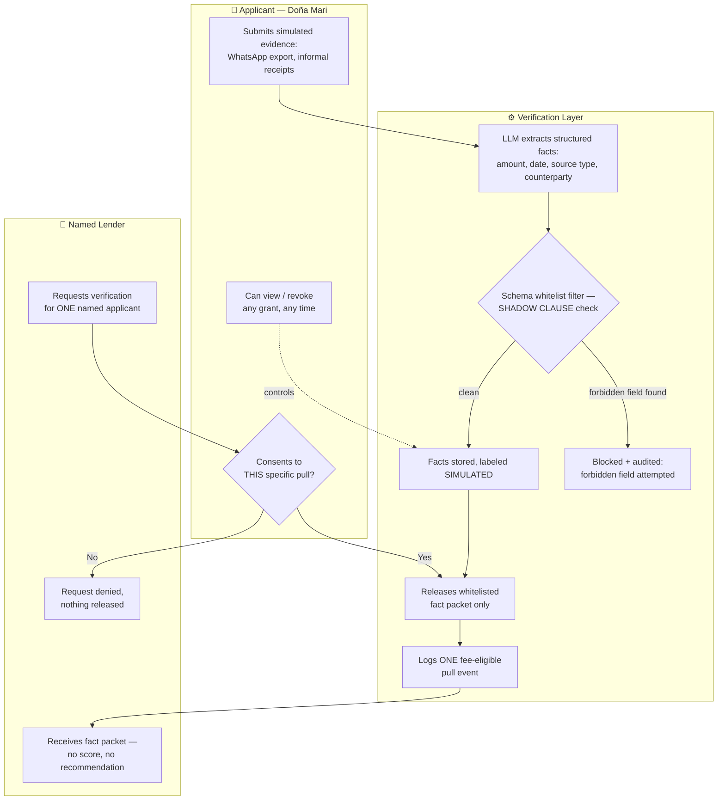

# PACKET — Week 2, Business Bending
### Team 4 · The Golden Elephant · Emilio Gómez (Money)

---

## 1. Problem, in my words

*The Golden Elephant* shows an insurer whose model silently reconstructs a social caste
through proxy variables — nobody typed "family" or "who you know" into the model, but the
model found its way there anyway, because its only objective was "lower premiums" and
nothing was watching *how* it got there.

The financial-access version of that harm in Mexico isn't hypothetical: 63% of Mexicans are
formally uncredited, and the informal lending that fills the gap runs 10–20% *monthly*.
Alternative-data underwriting (invoices, payments, marketplace records) is the real fix — and
it's already working, above a certain floor. Below that floor — no CFDI invoices, no bank
account, paid in cash and WhatsApp — nobody is building *evidence* for the applicant at all.
Everyone in this space builds proof for lenders about people who are already partially
legible. Nobody builds proof for the fully informal vendor.

My slice doesn't try to solve credit access. It solves the one precondition every honest
version of credit access needs first: a way to hand a lender **verified facts, not a
verdict** — and to make sure the business model itself can't quietly turn into a second
Ganesh Insurance.

## 2. Exact user

**Primary — the applicant:** an informal vendor like *Doña Mari, 54*, sells food outside the
metro, paid in cash and WhatsApp transfers, no CFDI invoices, no bank account. She uses
WhatsApp but distrusts apps, reads slowly, and gives up silently when confused.

**Secondary — the requester:** a named, vetted lender's loan officer who wants to evaluate
Doña Mari's application and needs facts about her, not a score.

## 3. Success definition

*Before the module closes:* a lender account can request access to one named applicant's
evidence packet; the applicant must explicitly consent before anything releases; exactly one
fee-eligible "pull" event is logged per release, tied to that lender and that applicant only;
and any attempt to include a Shadow-Clause field (family, geography-of-origin, contact list,
social graph) anywhere in the packet is rejected at the API layer, not silently dropped.

## 4. Mockup

`docs/mockup_consent_gate.svg` — a generated wireframe of the applicant-side consent screen
(the moment a lender's pull request is waiting on Doña Mari's yes/no). See file in this
folder. *(If you want a higher-fidelity version, paste this into an image generator: "Mobile
screen mockup, plain flat UI, Spanish-language, a WhatsApp-style consent card reading
'Banco Azteca quiere ver tus 3 comprobantes verificados de los últimos 30 días' with two
buttons 'Permitir esta vez' and 'No permitir', a small line below reading 'Nunca se comparte
tu familia, ubicación ni contactos', clean sans-serif, high contrast, no logos.")*

## 5. Flow (Mermaid, swimlanes)

## 6. Benchmark line

The best existing solution on Earth for this is **Konfío** (Mexico, ~4.4M MSMEs underwritten
via CFDI/SAT invoice data, backed by IFC and IDB Invest) paired with **Belvo** (LatAm open
banking data pooled for fintechs) — together they prove alternative-data underwriting works
at scale, for anyone who already issues invoices or holds a bank account.

Mine differs by refusing to score or lend at all — it only verifies and hands over
source-backed facts per lender-authorized pull — and localizes by targeting exactly the
population beneath both floors: no invoices, no bank account, paid in cash and WhatsApp.

## 7. The long view (3 years)

If this slice works, it becomes Mexico's neutral evidence layer for the informal economy:
any vetted lender requests a specific, consented, per-pull fact packet instead of building
its own underwriting pipeline from zero. Once real SAT/CFDI and WhatsApp Business API
access exist under LFPDPPP's still-unenforced human-review right, the simulated sources here
get swapped for verified ones without changing the product's shape. The business model
stays a toll on verification requests, never a cut of loans approved — so growth pressure
stays on verifying more people, never on approving more debt.

## 8. Scope cut — NOT building this week

- No real SAT/CFDI or WhatsApp Business API integration — simulated data only, clearly
  labeled on screen.
- No real money movement or fee collection — the fee event is logged, not charged.
- No scoring, risk tier, or approve/deny recommendation, ever — that's the whole point.
- No lender marketplace, no multi-lender comparison — one named lender per request.
- Not building Nico's consent-log UI or Cristina's repair flow — those are their slices;
  mine only needs a minimal consent prompt to prove the gate works.

## 9. Architecture + stack

| Layer | Choice | Why |
|---|---|---|
| Frontend | Next.js (React) on Vercel | free tier, fast deploys, matches course floor |
| Auth | Supabase Auth, "Sign in with Google" | no personal data behind an open door |
| Database | Supabase Postgres, **Row Level Security ON** | applicant sees only her own rows; lender sees only packets she released |
| Extraction | Claude API (LLM) | turns raw simulated text/receipts into structured fact rows — extraction only, never scoring |
| Validation | Schema whitelist (allowed fields only) | enforces Shadow Clause at ingestion AND at release, not just at ingestion |
| Fee event | Server-side API route + `pull_events` table | one row per consented release; this is where a real fee would fire later |
| Secrets | Vercel environment variables | no keys in the repo |

## 10. Test plan

1. **Schema rejection test** — submit a payload containing a forbidden field (e.g.
   `contact_list`, `geography_of_origin`) at ingestion → expect a hard rejection, logged.
2. **Consent gate test** — lender requests a pull with no applicant consent → expect
   403/blocked, zero data released, zero fee events logged.
3. **Happy path test** — applicant consents → expect exactly one whitelisted fact packet
   released, exactly one `pull_events` row created, tied to that lender + that applicant.
4. **Revoke test** — applicant revokes a prior grant → expect future pulls on that grant to
   fail even if previously consented.
5. **Mechanical pass** — run the above end-to-end on the deployed URL, find at least one
   real bug, fix it, redeploy.
6. **Persona test (Doña Mari)** — fresh chat, persona from Section 2, walk her through the
   consent screen via screenshots, log every hesitation, fix the worst one before the
   deadline.
